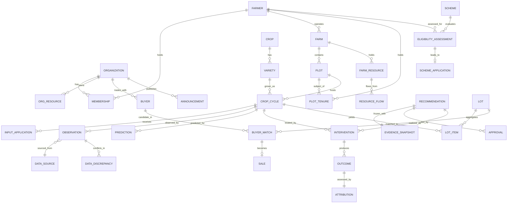

# Data Model — AgriVardhak

Version 1.0 · 2026-08-22 · **Baselined**

This document resolves the eight open data-model questions from the discovery session and
specifies the canonical entities, relationships, events and provenance machinery.

The discovery session ended mid-interrogation with these questions unanswered. Section 1
answers all eight with reasoning. Sections 2–8 are the resulting model.

---

## 1. The eight decisions, resolved

### Q1 — Generic `Organization`, or `FPO` as the core entity?

**Decision: generic `Organization` with a `type` discriminator.** (ADR-0002)

```
Organization
├── type: FPO | PACS | SHG | FPC | COOPERATIVE
├── legal_form, registration_no
├── location (district, state, PostGIS point)
├── memberships → Farmer
├── resources    (working capital, warehouse, cold storage, machinery, vehicles, processing)
├── buyers, contracts, inventory
└── calendar
```

*Why.* All three organizational forms were requested. They differ in legal form, governance
and money flow — not in what the intelligence layer needs to know. Every module operates on
`Organization`; supporting PACS later becomes `organization.type = 'PACS'` plus a governance
sub-profile, not a rewrite. The cost today is one enum column.

*What we deliberately do not do:* build separate FPO/PACS/SHG tables, or push type-specific
logic into the modules. Type-specific behaviour lives in a `GovernanceProfile` value object.

---

### Q2 — Can a farmer belong to multiple organizations?

**Decision: yes. `Membership` is a first-class join entity, built from day one.**

```
Farmer ──< Membership >── Organization
             ├── role (MEMBER | DIRECTOR | STAFF)
             ├── joined_at, left_at, status
             ├── shares_held, patronage_units
             └── is_primary
```

*Why.* It happens in reality — a farmer is routinely in an FPO for produce, a PACS for
credit and an SHG for savings. Making `Farmer.organization_id` a column would couple the
farmer permanently to one collective and force a painful migration later. A join table costs
nothing now.

*MVP simplification:* the UI shows the `is_primary` membership only. Aggregations always
scope by `organization_id`, so a multi-org farmer never double-counts.

---

### Q3 — Separate land ownership from cultivation responsibility?

**Decision: yes — three distinct relationships.** (ADR-0003)

| Relationship | Entity | Question it answers |
|---|---|---|
| Physical land | `Plot` | What is this piece of land? |
| Who holds it and how | `PlotTenure` | Who owns/leases/sharecrops it, for what share, over what period? |
| Organizational tie | `Membership` | Which collective is this person part of? |

```
Farmer ──< PlotTenure >── Plot ──> Farm ──> (operator) Farmer
              ├── tenure_type: OWNED | LEASED | SHARECROPPED | JOINT | ALLOTTED | OTHER
              ├── share_pct
              ├── valid_from, valid_to
              └── evidence_ref (record of rights, if any)
```

*Why.* Tenancy, leased land, family farms, shared cultivation and ownership disputes are the
normal case in Indian smallholder agriculture, not the exception. Collapsing them into
`plot.farmer_id` makes three things impossible: correct benefit attribution (who receives a
subsidy for this plot?), correct dispute resolution (whose share of the harvest?), and
correct aggregation (a leased plot counted under two farmers).

`Farm.operator_farmer_id` records who actually runs the operation day to day, which may
differ from every tenure holder.

*Constraint:* active tenure shares on a plot must sum to 100%. If they do not, the system
raises a `DataDiscrepancy` rather than rejecting the data — real records are messy, and
refusing the write loses the information.

---

### Q4 — Multiple crop cycles per plot over time?

**Decision: yes. `CropCycle` is the central temporal entity of the system.**

```
Plot A
├── CropCycle: Kharif 2025 → Rice (var. X)      [HARVESTED]
├── CropCycle: Rabi 2025   → Wheat              [HARVESTED]
└── CropCycle: Kharif 2026 → Rice (var. X)      [GROWING]
```

Two cycles on one plot may overlap in time **only** when both carry `intercrop_group_id`,
which models genuine intercropping and relay cropping. Otherwise an overlap is a data error
and raises a discrepancy.

`CropCycle` is where prediction, intervention, harvest, quality and sale all converge —
it is the join point of nearly every intelligence module. Its status machine:

```
PLANNED → SOWN → GROWING → HARVEST_READY → HARVESTED → SOLD → CLOSED
                    ↓
                 ABANDONED  (with reason: weather, disease, market, other)
```

---

### Q5 — Should the AI reason over the integrated-farming resource graph?

**Decision: model it now, reason POST-MVP.**

One entity, not six:

```
FarmResource
├── type: CROP | LIVESTOCK | POULTRY | FISHERY | COMPOST | MANURE
│       | AGROFORESTRY | WATER | EQUIPMENT | STRUCTURE
├── farm_id, plot_id?
├── quantity, unit
├── attributes (JSONB, type-specific)
└── active_from, active_to

ResourceFlow  (directed edge)
├── from_resource_id → to_resource_id
├── flow_type: FEED | FERTILITY | WATER | ENERGY | RESIDUE | LABOUR | INCOME
├── quantity_per_cycle, unit
└── confidence
```

This makes the classic cycles expressible as data:

```
Livestock ──FERTILITY──▶ Manure ──FERTILITY──▶ Crop ──RESIDUE──▶ Livestock
Pond ──WATER──▶ Crop        Fishery ──FERTILITY──▶ Crop
Agroforestry ──RESIDUE──▶ Compost ──FERTILITY──▶ Crop
```

*Why store now, reason later.* Six separate subsystems would triple the schema and none of
them would be deep enough to matter in 72 hours. One typed resource + a flow edge captures
everything the session asked for, renders as a farm resource graph in the UI (which demos
well), and leaves substitution reasoning — *"available manure offsets ₹X of purchased
fertilizer within the recommended nutrient plan"* — as a stretch goal (FR-208) that needs no
schema change.

---

### Q6 — Freeze the evidence snapshot on each recommendation?

**Decision: yes, mandatory and immutable.** (ADR-0004)

```
EvidenceSnapshot
├── id, recommendation_id
├── captured_at
├── payload: JSONB          -- every input used, verbatim
│     ├── module_outputs[]
│     ├── observations[]     (id + value + provenance at that instant)
│     ├── external_records[] (id + raw payload ref)
│     ├── org_state          (resources, capital, inventory)
│     └── prompt_version, model_id, module_versions{}
├── content_hash: SHA-256 of canonical JSON
└── (append-only; UPDATE/DELETE revoked at the DB grant level)
```

*Why.* This is the single most important structural decision in the model. Without it,
"Why did the AI recommend Buyer A on 22 August?" can only be answered by recomputing against
today's market data — which produces a *different* answer and destroys the audit trail. With
it, every past decision is permanently explainable, disputes are resolvable, and prediction
error can be measured against the actual inputs the model saw.

The content hash makes tampering detectable without a blockchain — which is exactly the
"very strong audit trail, not necessarily blockchain" the session called for.

*Cost.* Roughly 20–80 KB per recommendation. At 1,000 farmers × 20 recommendations/season
that is under 2 GB per season. Acceptable.

---

### Q7 — Separate `Prediction` from `Recommendation`?

**Decision: yes, separate entities with separate lifecycles.**

| | `Prediction` | `Recommendation` |
|---|---|---|
| Is | a claim about reality | a proposed action |
| Example | expected yield 4.2 t, confidence 0.81 | secure Buyer A for 300 t |
| Lifecycle | `ISSUED → REALIZED` (actual recorded, error computed) | `SUGGESTED → REVIEWED → APPROVED → EXECUTED → OUTCOME_RECORDED` |
| Can be approved | no | yes |
| Evaluated by | accuracy vs actual | adherence + outcome + attribution |
| Owner | a module | the orchestrator |

*Why.* Collapsing them destroys both evaluations. A recommendation that was correct but not
followed is not a failed prediction. A prediction that was accurate but led to a bad action
is not a bad prediction. Separating them is what lets us say honestly *which part of the
system was wrong*.

A recommendation **cites** predictions via `EvidenceRef`; it does not embed them.

---

### Q8 — Record whether the farmer followed the recommendation?

**Decision: yes. Adherence is mandatory before attribution.**

```
Recommendation ──▶ Intervention ──▶ Outcome ──▶ Attribution

Intervention
├── recommendation_id?          (null = unprompted action, still valuable)
├── action_taken, executed_at, executed_by
├── cost_paise
└── adherence
      ├── followed: YES | PARTIAL | NO | UNKNOWN
      ├── fidelity: 0..1        (how faithfully, when PARTIAL)
      ├── delay_days
      └── deviation_notes

Outcome
├── target (crop_cycle | farmer | organization | lot)
├── baseline_value, observed_value, unit
├── period_start, period_end
└── external_conditions: JSONB  (rainfall, temp, price movement over the period)

Attribution
├── outcome_id, intervention_id
├── strength: HIGH | MODERATE | UNCERTAIN | CONFOUNDED
├── confounders: text[]
└── rationale
```

*Why.* This is the difference between a learning system and a system that learns the wrong
thing. If we record only "recommended preventive treatment → disease severity fell 40% → 12%"
without knowing the farmer never applied it and it simply rained, the model learns a false
causal relationship and confidently repeats bad advice at scale.

**Hard rule (INV-7, FR-1004):** attribution may not be computed when `adherence.followed =
UNKNOWN`. `CONFOUNDED` is a legitimate, expected, and frequently correct result.

---

## 2. Entity catalog

Legend — **B** business entity · **E** event/append-only · **D** derived AI output ·
**G** governance/metadata.

| Entity | Kind | Created by | Mutable? | Key relationships |
|---|---|---|---|---|
| `Organization` | B | Admin | yes | memberships, resources, buyers, calendar |
| `GovernanceProfile` | B | Admin | yes | → Organization |
| `OrgResource` | B | FPO staff | yes | → Organization |
| `User` | B | Admin/self | yes | → roles, → Farmer? |
| `RoleGrant` | G | Admin | yes | User × Organization × role |
| `Farmer` | B | FPO staff | yes | memberships, farms, tenures, resources |
| `Membership` | B | FPO staff | yes | Farmer × Organization |
| `Farm` | B | FPO staff | yes | → Farmer (operator), plots |
| `Plot` | B | FPO staff | yes | → Farm, tenures, crop cycles, geometry |
| `PlotTenure` | B | FPO staff | yes | Farmer × Plot |
| `Crop` / `Variety` | B | Admin (reference) | yes | agronomic reference data |
| `CropCycle` | B | FPO staff / farmer | yes | → Plot, → Variety; the central entity |
| `FarmResource` | B | FPO staff / farmer | yes | → Farm |
| `ResourceFlow` | B | FPO staff | yes | FarmResource × FarmResource |
| `InputApplication` | E | field officer / farmer | no | → CropCycle |
| `Observation` | E | any source | **no** | → any subject; carries provenance |
| `DataDiscrepancy` | E→G | system | status only | → Observations |
| `ExternalRecord` | E | ingestion | no | weather / price / scheme / news raw payload |
| `DataSource` | G | Admin | yes | trust weight, cadence |
| `Prediction` | D | module | **no** | → CropCycle/Organization; realized later |
| `Recommendation` | D | orchestrator | status only | → EvidenceSnapshot, approvals |
| `EvidenceSnapshot` | D | orchestrator | **no** | → Recommendation |
| `Approval` | E | human | no | → Recommendation |
| `Intervention` | E | human | no | → Recommendation?, → CropCycle |
| `Outcome` | E | system/human | no | → target |
| `Attribution` | D | system | no | Outcome × Intervention |
| `RiskRegisterEntry` | D | Risk module | status only | → Organization |
| `Scheme` | B | Admin/ingestion | yes | eligibility rules, documents |
| `EligibilityAssessment` | D | Scheme module | **no** | Farmer × Scheme |
| `SchemeApplication` | B | FPO staff | yes | Farmer × Scheme, status machine |
| `Buyer` | B | FPO staff | yes | → Organization |
| `DemandSignal` | E | ingestion / FPO staff | no | → Buyer, → Crop |
| `Lot` | B | FPO staff | yes | aggregation of crop-cycle produce |
| `BuyerMatch` | D | Market module | no | Lot × Buyer, with effective price |
| `Sale` | B | FPO staff | yes | Lot × Buyer |
| `FundingRequirement` | D | Funding module | no | → CropCycle |
| `FundingAllocation` | B | FPO staff | yes | → Farmer, → CropCycle |
| `CalendarEvent` | B | any | yes | → subject, origin, approval state |
| `Task` | B | system/human | yes | → CalendarEvent, assignee role |
| `Announcement` | B | FPO staff | yes | → Organization, visibility |
| `Consent` | G | Farmer | append-only versions | → Farmer, purpose |
| `AuditRecord` | E | system | **no** | actor × action × subject |
| `DomainEvent` | E | system | **no** | outbox |

---

## 3. Core ERD



---

## 4. Provenance {#provenance}

### 4.1 The design choice

**Decision (T-02, ADR-0005): observation-centric append-only model for volatile facts;
plain columns for stable facts.**

Attaching `{source, timestamp, confidence, verification}` to *every column* of *every table*
produces EAV sprawl: unqueryable, unindexable, and miserable to work with under time pressure.
Attaching it to nothing loses the property the whole product depends on.

The split:

| Fact kind | Storage | Example |
|---|---|---|
| **Stable** — set once, rarely changes, low decision impact | plain column on the entity | farmer name, phone, plot registration id |
| **Volatile & consequential** — changes over time, drives decisions | `Observation` rows | crop health, plot area (disputed), soil pH, expected yield, water availability, livestock count |
| **External** | `ExternalRecord` + derived `Observation` | rainfall, mandi price, scheme text |
| **Derived** | `Prediction` / module output | expected grade distribution |

A `current_observation` materialized view resolves the current value per
`(subject_type, subject_id, attribute)` so ordinary queries stay simple.

### 4.2 The Observation record

```sql
CREATE TYPE source_type AS ENUM (
  'FIELD_OFFICER', 'FARMER_SELF_REPORT', 'AI_INFERENCE',
  'EXTERNAL_SOURCE', 'ORG_RECORD', 'FIXTURE'
);
CREATE TYPE verification_status AS ENUM (
  'UNVERIFIED', 'VERIFIED', 'DISPUTED', 'SUPERSEDED'
);

CREATE TABLE observation (
  id                  UUID PRIMARY KEY,
  subject_type        TEXT NOT NULL,          -- 'crop_cycle' | 'plot' | 'farmer' | ...
  subject_id          UUID NOT NULL,
  attribute           TEXT NOT NULL,          -- 'crop_health_pct' | 'area_sqm' | ...
  value_numeric       NUMERIC,
  value_text          TEXT,
  value_json          JSONB,
  unit                TEXT,
  source_type         source_type NOT NULL,
  source_id           UUID REFERENCES data_source(id),
  source_ref          TEXT,                   -- image id, external record id, user id
  observed_at         TIMESTAMPTZ NOT NULL,   -- when reality was as stated
  recorded_at         TIMESTAMPTZ NOT NULL DEFAULT now(),
  confidence          NUMERIC(4,3) NOT NULL CHECK (confidence BETWEEN 0 AND 1),
  verification_status verification_status NOT NULL DEFAULT 'UNVERIFIED',
  verified_by         UUID,
  verified_at         TIMESTAMPTZ,
  superseded_by       UUID REFERENCES observation(id)
);
CREATE INDEX ON observation (subject_type, subject_id, attribute, observed_at DESC);
```

### 4.3 Trust weights and confidence decay

Base trust by source (configurable per `DataSource`, these are the defaults):

| Source | Base trust |
|---|---|
| `FIELD_OFFICER` (verified) | 0.95 |
| `ORG_RECORD` | 0.90 |
| `EXTERNAL_SOURCE` (official) | 0.85 |
| `FARMER_SELF_REPORT` | 0.70 |
| `AI_INFERENCE` | model-reported, capped at 0.85 |
| `FIXTURE` | 0.50, always UI-labelled |

Effective confidence used by modules:

```
effective = base_trust × verification_multiplier × 0.5 ^ (age_days / half_life_days)

verification_multiplier:  VERIFIED 1.0 · UNVERIFIED 0.85 · DISPUTED 0.5
```

Per-attribute half-lives (`attribute_policy` table):

| Attribute | Half-life | Stale after |
|---|---|---|
| `crop_health_pct` | 7 d | 21 d |
| `crop_stage` | 10 d | 30 d |
| `soil_moisture` | 3 d | 10 d |
| `expected_yield_kg` | 14 d | 45 d |
| `market_price_paise_per_kg` | 2 d | 7 d |
| `area_sqm` | 365 d | 730 d |
| `soil_ph` | 180 d | 540 d |
| `water_availability` | 60 d | 180 d |
| `livestock_count` | 90 d | 365 d |

### 4.4 Conflict handling

```
Farmer says      : 2.0 acres   (FARMER_SELF_REPORT, 2026-06-01, conf 0.70)
Govt record says : 1.6 acres   (EXTERNAL_SOURCE,    2024-03-11, conf 0.85 → decayed 0.52)
Field officer    : 1.8 acres   (FIELD_OFFICER,      2026-08-15, conf 0.95)
```

The system does **not** output "1.8 acres". It creates:

```
DataDiscrepancy
├── subject: plot/<id>, attribute: area_sqm
├── claims: [ {2.0, farmer, ...}, {1.6, govt, ...}, {1.8, officer, ...} ]
├── spread_pct: 25
├── tolerance_pct: 5           (from attribute_policy)
├── status: OPEN
├── effective_value: 1.8 acres  -- highest-trust, but…
├── effective_confidence: 0.62  -- …penalized for the open conflict
└── resolution: null            -- requires a human with verification authority
```

The UI shows the conflict badge **at the point of use** — on the plot card, and in any
Decision Packet that relied on the value. Downstream module confidence is multiplied by
`(1 − min(0.4, spread_pct/100))`.

Conflict penalty is applied once, at the observation-resolution layer, so it propagates
automatically into every module and into the packet's overall confidence.

---

## 5. Event catalog

Every domain-state change writes a `DomainEvent` in the same transaction (transactional
outbox, ADR-0007). Events are the substrate for the calendar, the audit trail, notifications
and the learning loop.

```sql
CREATE TABLE domain_event (
  id             UUID PRIMARY KEY,           -- UUIDv7, ordered
  event_type     TEXT NOT NULL,
  aggregate_type TEXT NOT NULL,
  aggregate_id   UUID NOT NULL,
  organization_id UUID,
  actor_id       UUID,
  actor_kind     TEXT NOT NULL,              -- 'HUMAN' | 'SYSTEM' | 'AI'
  occurred_at    TIMESTAMPTZ NOT NULL DEFAULT now(),
  payload        JSONB NOT NULL,
  published_at   TIMESTAMPTZ                 -- outbox dispatch marker
);
```

| Domain | Events |
|---|---|
| Membership | `FarmerRegistered` `MembershipCreated` `MembershipEnded` |
| Land | `FarmCreated` `PlotCreated` `PlotBoundaryUpdated` `TenureRecorded` `TenureDisputed` |
| Crop | `CropCycleCreated` `CropCycleSown` `CropStageAdvanced` `CropCycleAbandoned` `HarvestRecorded` |
| Observation | `ObservationRecorded` `HealthObserved` `ObservationVerified` `DiscrepancyDetected` `DiscrepancyResolved` `ObservationStale` |
| Resource | `FarmResourceAdded` `ResourceFlowDeclared` |
| Intelligence | `PredictionIssued` `PredictionRealized` `RiskIdentified` `RiskEscalated` `RiskClosed` `OutbreakSignalRaised` |
| External | `WeatherIngested` `MarketPriceIngested` `PolicyEventDetected` `NewsEventClassified` `SupplyChainSignalDetected` |
| Decision | `RecommendationGenerated` `RecommendationReviewed` `RecommendationApproved` `RecommendationRejected` `RecommendationModified` `RecommendationSuperseded` `RecommendationExecuted` |
| Market | `DemandSignalReceived` `LotFormed` `BuyerMatched` `NegotiationBriefGenerated` `SaleAgreed` `SaleCompleted` |
| Scheme | `SchemeIngested` `EligibilityAssessed` `DocumentGapIdentified` `ApplicationSubmitted` `ApplicationStatusChanged` `BenefitReceived` |
| Funding | `FundingRequirementComputed` `AllocationProposed` `AllocationApproved` `AllocationDisbursed` `AllocationAcknowledged` |
| Calendar | `CalendarEventCreated` `CalendarEventApproved` `TaskAssigned` `TaskCompleted` |
| Learning | `InterventionExecuted` `AdherenceRecorded` `OutcomeRecorded` `AttributionComputed` |
| Governance | `ConsentGranted` `ConsentRevoked` `SensitiveDataAccessed` `AnnouncementShared` |

---

## 6. The decision lifecycle in data

```
                       ┌──────────────────────┐
   module outputs ────▶│    Recommendation    │◀──── EvidenceSnapshot (frozen, hashed)
                       │  status = SUGGESTED  │
                       └──────────┬───────────┘
                                  │ human opens it
                       ┌──────────▼───────────┐
                       │      REVIEWED        │
                       └──────────┬───────────┘
                    approve / modify │ reject
             ┌────────────────────┴──────────────┐
   ┌─────────▼──────────┐              ┌─────────▼────────┐
   │      APPROVED      │              │    REJECTED      │  (+ reason, kept forever)
   │  + Approval row    │              └──────────────────┘
   │  + approved_value  │  ← modification stored separately from recommended_value
   └─────────┬──────────┘
             │  system executes; never before this point (INV-1)
   ┌─────────▼──────────┐
   │      EXECUTED      │──▶ Intervention (+ adherence)
   └─────────┬──────────┘
             │
   ┌─────────▼──────────┐
   │ OUTCOME_RECORDED   │──▶ Outcome ──▶ Attribution
   └────────────────────┘

   New material data at any point ──▶ RecommendationSuperseded
                                       (new row; the old one is never mutated)
```

`Approval` carries: approver id, role exercised, decision, `approved_value` (may differ from
`recommended_value`), rationale, timestamp. This is what makes the *"AI recommended ₹35,000;
CEO approved ₹32,000"* trail exist as data rather than as a log line.

---

## 7. Information boundary in the schema {#boundary}

The farmer↔FPO boundary (INV-5) is enforced by data, not prompts.

Every readable row resolves to a **visibility scope**:

| Scope | Who can read |
|---|---|
| `OWNER` | The farmer the row is about, plus org staff with a role grant covering that farmer |
| `ORG_INTERNAL` | Org staff only — never a farmer, including the farmer it concerns |
| `SHARED_WITH_MEMBERS` | Org staff + all members |
| `PUBLIC` | Anyone authenticated |

`ORG_INTERNAL` covers: buyer negotiation state, FPO finances, other farmers' risk scores,
internal strategy recommendations, cross-farmer comparisons.

The repository layer takes a `ContextScope(actor, organization, subject_ids)` and applies the
filter in SQL. The assistant's retrieval runs through the same repositories. **A farmer's
assistant context therefore cannot contain another farmer's row, because the query never
returned it** — there is no prompt instruction to bypass. This is what FR-809 requires and
what `test_farmer_context_excludes_org_internal` asserts.

---

## 8. Reference data & units

| Concern | Canonical | Rendered |
|---|---|---|
| Money | `BIGINT` paise | ₹ with lakh/crore grouping in Hindi views |
| Area | `NUMERIC(14,2)` square metres | acres (`/4046.8564224`) or hectares |
| Mass | `NUMERIC(14,3)` kilograms | kg / quintal / tonne |
| Price | `BIGINT` paise per kg | ₹/kg or ₹/quintal |
| Volume (water) | `NUMERIC` litres | litres / m³ |
| Geometry | `geography(Polygon, 4326)` | map |
| Time | `TIMESTAMPTZ` UTC | `Asia/Kolkata` |
| Season | enum `KHARIF · RABI · ZAID · PERENNIAL` + year | "Kharif 2026" |
| Grade | enum `A · B · C · REJECT` + parameter JSONB | localized label |

Reference tables (`crop`, `variety`, `agro_climatic_zone`, `mandi`, `scheme`, `input_product`)
are seeded from cited sources listed in `seed/sources.md`. Anything not traceable to a cited
source is flagged `synthetic = true` and rendered with the `DEMO DATA` marker (UI-04).

---

## 9. What we chose not to model (and why)

| Not modelled | Why |
|---|---|
| Blockchain / distributed ledger | An append-only table with content hashes and a full audit trail gives the same dispute-resolution property at a fraction of the cost. The session explicitly said *"not necessarily blockchain, just a very strong audit trail"*. |
| Separate FPO / PACS / SHG tables | Q1. One `Organization` with a type. |
| `farmer.organization_id` column | Q2. Would block multi-membership. |
| Six integrated-farming subsystems | Q5. One `FarmResource` + `ResourceFlow`. |
| Full EAV provenance on every column | §4.1. Volatile facts only. |
| A generic workflow engine | Two state machines (recommendation, application) are enough; a workflow engine is 3 days of work that demos as nothing. |
| Payments / ledger / disbursement rails | Out of scope (D-21). `FundingAllocation` records the decision, not the money movement. |
| Message broker | ADR-0007. A Postgres outbox is sufficient at this scale. |
